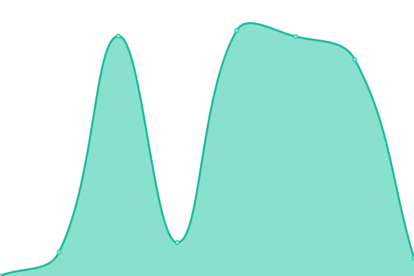
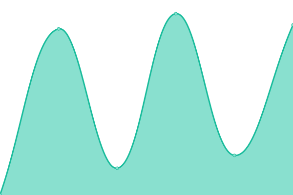
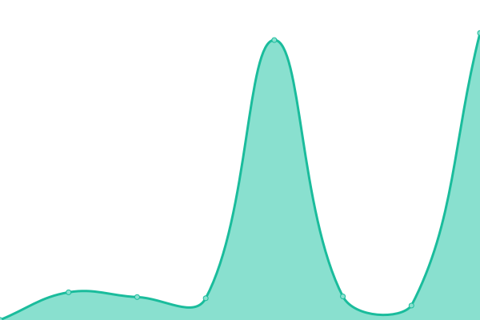
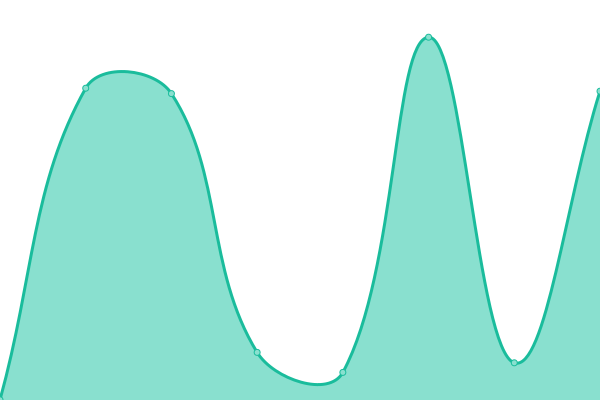
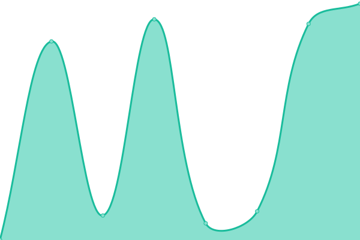

# [📈 Live Status](https://activmediacorp.github.io/status): <!--live status--> **🟥 Complete outage**

This repository contains the open-source uptime monitor and status page for [Activmedia](https://activmediacorp.github.io/status), powered by [Upptime](https://github.com/upptime/upptime).

With [Upptime](https://upptime.js.org), you can get your own unlimited and free uptime monitor and status page, powered entirely by a GitHub repository. We use [Issues](https://github.com/activmediacorp/status/issues) as incident reports, [Actions](https://github.com/activmediacorp/status/actions) as uptime monitors, and [Pages](https://activmediacorp.github.io/status) for the status page.

<!--start: status pages-->
<!-- This summary is generated by Upptime (https://github.com/upptime/upptime) -->
<!-- Do not edit this manually, your changes will be overwritten -->
<!-- prettier-ignore -->
| URL | Status | History | Response Time | Uptime |
| --- | ------ | ------- | ------------- | ------ |
|  [Beat](https://beatstreaming.com) | 🟥 Down | [beat.yml](https://github.com/beatstreaming/status/commits/HEAD/history/beat.yml) | 

 0ms
     
 | 

<a href="https://activmediacorp.github.io/status/history/beat">0.00%</a>
    

|  [Beat Lossless](https://lossless.api.beatstreaming.com) | 🟥 Down | [beat-lossless.yml](https://github.com/beatstreaming/status/commits/HEAD/history/beat-lossless.yml) | 

 0ms
     
 | 

<a href="https://activmediacorp.github.io/status/history/beat-lossless">0.00%</a>
    

|  [Beat CDN](https://cdn.beatstreaming.com) | 🟥 Down | [beat-cdn.yml](https://github.com/beatstreaming/status/commits/HEAD/history/beat-cdn.yml) | 

 0ms
     
 | 

<a href="https://activmediacorp.github.io/status/history/beat-cdn">0.00%</a>
    

|  [Beat Proxy](https://proxy.beatstreaming.com) | 🟥 Down | [beat-proxy.yml](https://github.com/beatstreaming/status/commits/HEAD/history/beat-proxy.yml) | 

 0ms
     
 | 

<a href="https://activmediacorp.github.io/status/history/beat-proxy">0.00%</a>
    

|  [Beat API](https://api.beatstreaming.com) | 🟥 Down | [beat-api.yml](https://github.com/beatstreaming/status/commits/HEAD/history/beat-api.yml) | 

 0ms
     
 | 

<a href="https://activmediacorp.github.io/status/history/beat-api">0.00%</a>
    

|  [Beat Music](https://music.api.beatstreaming.com) | 🟥 Down | [beat-music.yml](https://github.com/beatstreaming/status/commits/HEAD/history/beat-music.yml) | 

 0ms
     
 | 

<a href="https://activmediacorp.github.io/status/history/beat-music">0.00%</a>
    

|  [Beat Music Player](https://player.music.api.beatstreaming.com) | 🟥 Down | [beat-music-player.yml](https://github.com/beatstreaming/status/commits/HEAD/history/beat-music-player.yml) | 

 0ms
     
 | 

<a href="https://activmediacorp.github.io/status/history/beat-music-player">0.00%</a>
    

|  [Beat Stream](https://stream.api.beatstreaming.com) | 🟥 Down | [beat-stream.yml](https://github.com/beatstreaming/status/commits/HEAD/history/beat-stream.yml) | 

 0ms
     
 | 

<a href="https://activmediacorp.github.io/status/history/beat-stream">0.00%</a>
    

|  [Show Server](https://server.show.api.beatstreaming.com) | 🟥 Down | [show-server.yml](https://github.com/beatstreaming/status/commits/HEAD/history/show-server.yml) | 

 0ms
     
 | 

<a href="https://activmediacorp.github.io/status/history/show-server">0.00%</a>
    

|  [Show Meta](https://meta.show.api.beatstreaming.com) | 🟥 Down | [show-meta.yml](https://github.com/beatstreaming/status/commits/HEAD/history/show-meta.yml) | 

 0ms
     
 | 

<a href="https://activmediacorp.github.io/status/history/show-meta">0.00%</a>
    

|  [Show Stream](https://stream.show.api.beatstreaming.com) | 🟥 Down | [show-stream.yml](https://github.com/beatstreaming/status/commits/HEAD/history/show-stream.yml) | 

 0ms
     
 | 

<a href="https://activmediacorp.github.io/status/history/show-stream">0.00%</a>
    

<!--end: status pages-->

[**Visit our status website →**](https://activmediacorp.github.io/status)

## 📄 License

- Powered by: [Upptime](https://github.com/upptime/upptime)
- Code: [MIT](./LICENSE) © [Anand Chowdhary](https://anandchowdhary.com), supported by [Pabio](https://pabio.com)
- Data in the `./history` directory: [Open Database License](https://opendatacommons.org/licenses/odbl/1-0/)
